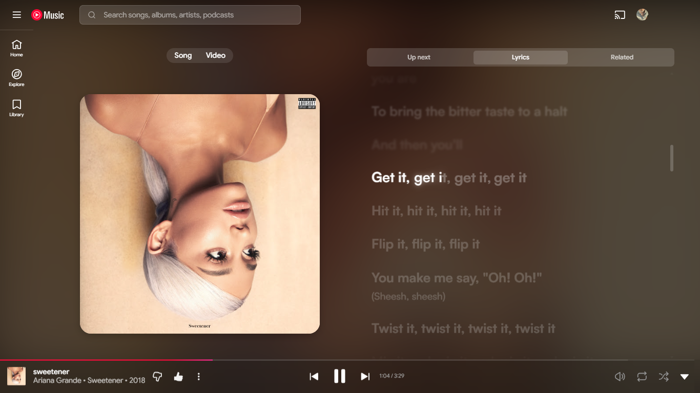
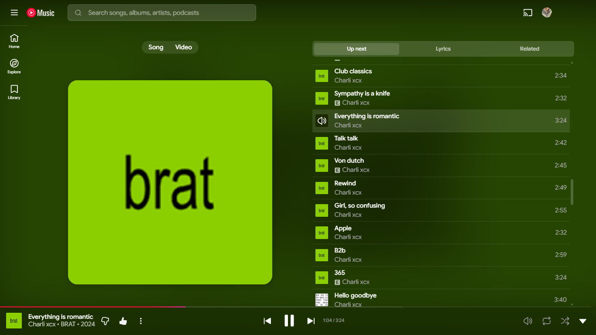
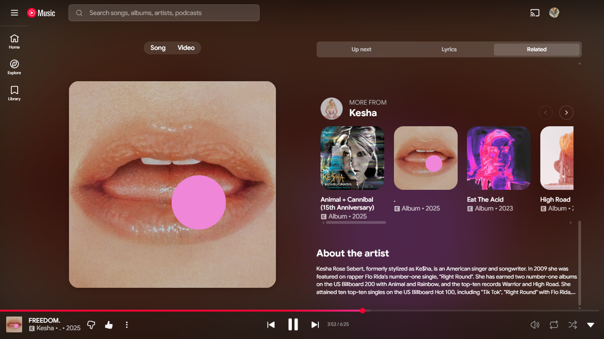

A clean and immersive theme for YouTube Music that transforms the default player with edge-to-edge album art, soft elevations, and a cinematic background.

## Key Features

- **Edge-to-Edge Artwork:** Album covers expand to perfectly fill the player area without awkward black borders.
- **Refined Aesthetics:** Extensive use of 24px rounded corners and subtle shadows for a polished, modern look.
- **Cinematic Lyrics:** Smooth scrolling with depth-of-field blur and opacity effects for inactive lyric lines.
- **Custom UI Elements:** Minimalist thin scrollbars, pill-shaped tab indicators, and semi-transparent controls.
- **Immersive Ambient Glow:** The background dynamically adapts to the current song with a high-saturation blur effect.

## Screenshots

### Lyrics View

### Up Next / Queue

### Related Content

## Installation Notes

For the best visual experience, ensure that the **"Album Art Background"** option is enabled in the Better Lyrics extension settings to take full advantage of the ambient glow effects.

## Compatibility

- Works with Better Lyrics v2.0.5.6+ 
